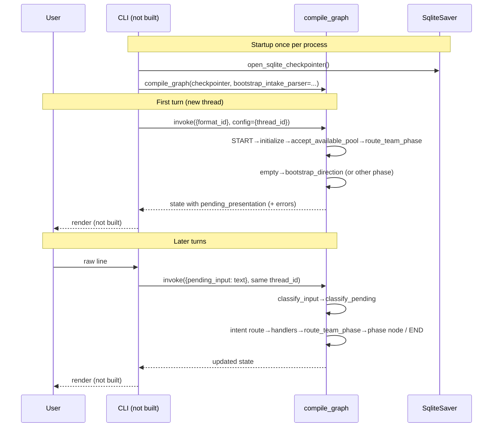

# CLI REPL (ADR-010) — discovery and design

**Date:** 2026-08-10  
**Audience:** Vu / design review  
**Status:** Discovery and design proposal only. No implementation. Every substantive
conclusion is labeled **Verified finding**, **Proposal**, or **Explicit scope decision**.

## Purpose and method

This is the last gap between “the graph is fully built and tested” and “a person can
actually run it.” `compile_cli_graph` was deliberately left unbuilt when the SQLite
checkpointer shipped, specifically to avoid wrapping a REPL that did not exist yet
(`docs/master_project_log.md`, SQLite checkpointer entry).

The source check covered:

1. ADR-010’s original text and adjacent ADRs that affect a human interface;
2. `compile_graph`, `open_sqlite_checkpointer`, and how tests drive turns;
3. `classify_input` / `classify_pending` dispatch and bootstrap injection;
4. `PendingPresentation` construction across empty / single-locked / multi-locked paths;
5. thread identity, SqliteSaver listing, and durable DB location;
6. labeled degradation / error fields a human would need to see.

Primary sources:

- `docs/architecture_decisions.md` (ADR-009, ADR-010, ADR-013, ADR-027);
- `docs/CURSOR_HANDOFF.md`;
- `docs/master_project_log.md` (SQLite checkpointer / deferred CLI notes);
- `recommender/graph.py`;
- `recommender/checkpointer.py`;
- `recommender/nodes.py`;
- `recommender/state.py`;
- `recommender/slot_fill.py`;
- `recommender/bootstrap.py`;
- `tests/recommender/test_sqlite_checkpointer.py`;
- `tests/recommender/test_empty_team_bootstrap.py`;
- `tests/recommender/test_steering.py`;
- `pyproject.toml`.

**Explicitly out of scope (per brief):** canonical name/form resolution; web/hosted UI;
large quick-pick / Team Preview; any new recommender logic. This task is only about making
the already-built graph reachable by a human.

---

## Executive conclusions

1. **Verified finding:** ADR-010 commits almost nothing beyond “CLI for v1; no dedicated
   UI.” Input/output model, session lifecycle, and UX are open.
2. **Verified finding:** A real turn cycle already exists in tests:
   `format_id` first invoke → later `pending_input` invokes on a shared `thread_id`, with
   optional `bootstrap_intake_parser` at compile time and a caller-owned SqliteSaver.
3. **Verified finding:** There is **no** render-to-plain-text layer. Consumers assert
   structured `PendingPresentation` / error fields. `prompt_text` / `notices` are only
   reliably populated on bootstrap paths; candidate selection, full-build confirmation, and
   completion preference leave most human-readable content in adjacent state fields.
4. **Verified finding:** Session identity today is a hardcoded `thread_id` string. Durability
   infrastructure (`open_sqlite_checkpointer`, env override, restart round-trip) is ready;
   “which thread is my team?” is not.
5. **Proposal:** ship a thin stdlib REPL that owns checkpointer lifetime, wires one
   bootstrap parser from env, renders presentation + error fields, and treats session
   identity as an explicit CLI concern (new vs resume), not a graph concern.
6. **Proposal:** treat terminal rendering as **new presentation-layer work** — scoped,
   not assumed trivial — because structured fields are incomplete as a human transcript.

---

## Part 1 — verified current state

### 1. What ADR-010 actually committed to

**Verified finding — `docs/architecture_decisions.md` ADR-010 (lines 622–624):**

```text
## ADR-010: Interface — CLI
**Decision:** CLI for v1. No dedicated UI.
**Status:** Decided.
```

That is the entire ADR. Committed:

| Topic | Committed? |
|-------|------------|
| Medium = CLI, not a dedicated UI | Yes |
| Input model (line vs slash-commands vs structured prompts) | No |
| Output / rendering model | No |
| Session create / resume / list | No |
| Exit / interrupt behavior | No |
| Default format / startup flags | No |
| Packaging (`python -m`, console script, etc.) | No |

**Adjacent decisions that constrain a CLI but are not ADR-010 itself:**

| Source | Constraint |
|--------|------------|
| ADR-009 | Manual text/list entry first; screenshot recognition later |
| ADR-013 | Model-agnostic LLM; Ollama for dev; Claude (or hosted) for demo |
| ADR-027 | Bootstrap free-form intake uses injected `bootstrap_intake_parser`; other pending kinds stay deterministic |
| Checkpointer log entry | SQLite factory shipped; `compile_cli_graph` deliberately deferred until a REPL exists |

**Clarification on the brief’s “ADR-014 amendment” wording:** the model-agnostic
**injection point** for bootstrap is ADR-027 (`build_graph` / `compile_graph(...,
bootstrap_intake_parser=...)`), under ADR-013’s provider policy. ADR-014 is the live-web-
search minimization policy and does not define the CLI parser seam.

**Still open (must be decided in this design, not “found” in ADR-010):** REPL shape,
renderer, session policy, env wiring for the parser, and human-facing error/interrupt
behavior.

---

### 2. Reusable infrastructure and the real turn cycle

#### `compile_graph`

**Verified finding — `recommender/graph.py:102-106`:**

```python
def compile_graph(checkpointer=None, *, bootstrap_intake_parser=None):
    """Compile with a caller-owned checkpointer, which may be durable."""
    return build_graph(
        bootstrap_intake_parser=bootstrap_intake_parser
    ).compile(checkpointer=checkpointer)
```

- No default checkpointer (tests use `MemorySaver`; CLI would pass SqliteSaver).
- `bootstrap_intake_parser` is compiled in via `functools.partial` on the `classify_input`
  node (`graph.py:51-56`), not passed per turn.

There is **no** `compile_cli_graph` symbol in the repo today (confirmed by search; deferred
explicitly in `docs/master_project_log.md`).

#### `open_sqlite_checkpointer`

**Verified finding — `recommender/checkpointer.py`:**

- `default_db_path()` → macOS Application Support / XDG data dir under
  `pokemon-champions-agents/checkpoints.db`, override `POKEMON_CHAMPIONS_CHECKPOINT_DB`.
- `open_sqlite_checkpointer(path=None) -> SqliteSaver` opens a long-lived connection;
  docstring forbids short-lived `from_conn_string` context managers for CLI.
- Caller owns close for process lifetime.
- Schema auto-creates; missing path creates a fresh DB.

#### `classify_pending` / `classify_input`

**Verified finding — `recommender/nodes.py:100-234`, `312-351`:**

- Subsequent turns require `pending_input` (`ValueError` if missing).
- `classify_input` always delegates to `classify_pending(text, pending_presentation,
  bootstrap_intake_parser=...)`.
- With **no** pending presentation: `NotImplementedError` (“not wired; monkeypatch in tests
  or configure ADR-013 LLM”) — generic free-form classification is still open.
- With pending presentation, dispatch is **kind-bound**:

| `kind` | Classifier behavior |
|--------|---------------------|
| `bootstrap_intake` | LLM parse via injected parser → `bootstrap_response` or fail-closed `pending_response` + `bootstrap_intake_error` |
| `completion_preference` | Ordinal / exact preference match, or defer |
| `full_build_confirmation` | Affirm → `full_slot_confirmed`; defer clears provisional; else re-prompt |
| `candidate_selection` (default v1) | Species id / ordinal / “yes”=default / defer |

Closed-set replies understood today: affirmatives, defer phrases, reject-all (mostly unused
for selection), ordinals `1`/`2`/`3`, prefixes `choose `/`pick `/`go with ` (`nodes.py:60-97`).

#### Bootstrap injection point

**Verified finding — `recommender/bootstrap.py:129-147`, ADR-027:**

- `build_ollama_bootstrap_intake_parser(model, **chat_kwargs)` is the only shipped factory.
- Optional dep: `pyproject.toml` extra `ollama` → `langchain-ollama`.
- Live smoke test gates on `BOOTSTRAP_OLLAMA_MODEL` (`test_empty_team_bootstrap.py:513-520`).
- No Claude/Anthropic factory exists yet; ADR-013 still treats hosted Claude as the
  demo/production reference.

#### Full turn cycle (raw text → presentation state)

**Verified finding** from graph wiring + tests (`test_empty_team_bootstrap.py:221-231`,
`test_sqlite_checkpointer.py:110-165`, `test_steering.py`):



Concrete sequence a REPL must call:

1. **Startup:** open saver; build parser; `compile_graph(...)`; choose `thread_id` +
   `format_id`.
2. **New session first turn:** `graph.invoke({"format_id": FORMAT}, config)` — do **not**
   send `pending_input` yet (`_route_start` needs missing `game_type` to hit `initialize`).
3. **Read result:** take returned state (or `graph.get_state(config).values`); render
   presentation + notices + error fields.
4. **Each user line:** `graph.invoke({"pending_input": line}, config)` with the **same**
   `thread_id`.
5. **Exit:** close `saver.conn` (process teardown).

`finish_pending_response` is intentionally empty (`nodes.py:354-355`) and ends the turn —
used when classification chooses `pending_response` (re-prompt / fail-closed without
advancing). Presentation usually persists because failed/ambiguous branches omit clearing
`pending_presentation`.

---

### 3. How presentation works today

**Verified finding — `PendingPresentation` (`recommender/state.py:266-280`):**

```text
schema_version, kind, slot_index, options, preference_options,
provisional_fingerprint, prompt_text, existing_pool_labels, notices
```

All fields are `total=False` — kinds populate different subsets.

| Kind | What gets filled today | Prompt / notices? |
|------|------------------------|-------------------|
| `bootstrap_intake` | `prompt_text`, `existing_pool_labels`, `notices` | Yes — only path that consistently sets both (`nodes.py:868-890`) |
| `candidate_selection` (bootstrap after intake) | options + bootstrap-added `prompt_text` / `notices` | Partial — bootstrap post-discovery sets them (`nodes.py:950-960`) |
| `candidate_selection` (slot_fill / single / multi) | `options` with species, source, evidence, optional role/direction fields | **No** `prompt_text` / `notices` (`slot_fill.py:1236-1267`) |
| `completion_preference` | `preference_options`, `slot_index`, schema_version 2 | **No** prompt text (`nodes.py:1235-1240`) |
| `full_build_confirmation` | `slot_index`, `provisional_fingerprint` | **No** prompt; build details live on `provisional_slot` (`nodes.py:467-472`) |

**Verified finding — notices:** the string `"notices"` is written only in
`recommender/nodes.py` bootstrap helpers. Unresolved pool labels become
`Couldn't identify: {label}` (`nodes.py:904-910`). Multi-locked / single-locked paths do
**not** copy `candidate_discovery_error` into `notices`.

**Verified finding — evidence:** `CandidateEvidence` (basis, confidence, producer_name,
`evidence` token tuple, optional branch/ids) is attached to options and survives selection
into `PendingSlotIntent`. Degradation tokens such as `calc_unavailable` are asserted in
tests (`test_team_phase_routing.py`) but never formatted for a terminal.

**Verified finding — no plain-text renderer:** repo search finds no
`format_pending` / `render_presentation` / equivalent. Tests inspect dict fields directly
(e.g. `test_unresolved_labels_are_ordered_and_rendered` asserts `notices` tuples, not stdout).

**Implication:** a CLI cannot “just print `prompt_text`.” For most turns it must compose
output from `pending_presentation` **plus** `provisional_slot`,
`candidate_discovery_error`, `bootstrap_intake_error`, `slot_commit_error`, and possibly
`last_team_review`.

---

### 4. Thread / session identity today

**Verified finding:** every multi-turn test hardcodes a string, e.g.:

- `{"configurable": {"thread_id": "bootstrap-routing"}}`
- `{"configurable": {"thread_id": f"sqlite-{suffix}"}}`
- `{"configurable": {"thread_id": f"steering-{suffix}"}}`

Nothing generates IDs, titles, or “last session” pointers.

**Verified finding — resume mechanics already work at the checkpointer layer:**
`test_restart_round_trips_pending_intent_and_provisional_slot` closes the connection, opens
a new saver on the same file, `get_state(thread)`, and continues. Same `thread_id` is the
entire resume contract.

**Verified finding — discovering threads:** `SqliteSaver.list(None, limit=N)` returns
checkpoint tuples across thread ids (live probe: two threads `"a"`/`"b"` both appeared).
Distinct ids are also available via `SELECT DISTINCT thread_id FROM checkpoints`. There is
no first-class “session metadata” table (title, format, updated_at) — only checkpoint rows.

**What a real CLI must invent (not present today):**

- how to mint a new `thread_id`;
- how to choose which existing thread to resume;
- whether `format_id` is flag-only on new sessions (required by `initialize`:
  `ValueError` if missing);
- whether incomplete vs complete teams are distinguishable for “continue where I left off”
  (derivable from `team_phase(state)` + presence of `pending_presentation`, but no helper
  exposes that as a session index).

---

## Part 2 — design proposal

### 1. REPL loop shape

**Proposal:** one stdlib module (e.g. `recommender/cli.py` or `python -m recommender`) that
owns process lifetime. Prefer **not** inventing a large framework; optional thin
`compile_cli_graph()` is only justified if it is literally:

```text
open_sqlite_checkpointer() + resolve_bootstrap_parser() + compile_graph(...)
```

and returns `(graph, saver, config_defaults)` — matching the master-log deferral rationale
(wrap only when the REPL exists).

**Startup**

1. Parse argv: `--new` / `--thread ID` / `--list-threads` / `--format` / provider flags
   (see §4). Default format: ADR-005’s VGC Reg M-B string already used everywhere in tests
   (`[Gen 9 Champions] VGC 2026 Reg M-B`).
2. `saver = open_sqlite_checkpointer()`; register `atexit` / `try/finally` to `saver.conn.close()`.
3. Resolve `bootstrap_intake_parser` (required for empty-team intake; without it the first
   user reply fail-closes with `bootstrap intake parser is not configured`).
4. `graph = compile_graph(checkpointer=saver, bootstrap_intake_parser=parser)`.
5. Resolve `thread_id` (see §3).
6. If new thread: `state = graph.invoke({"format_id": format_id}, config)`.
7. If resume: `state = graph.get_state(config).values` (no invoke until user speaks), then
   render current pending / team snapshot so the user sees where they left off.
8. Enter loop.

**Read-eval-print cycle**

```text
render(state)
while True:
    try:
        line = input(prompt).rstrip("\n")
    except EOFError:
        break
    if line in {":q", ":quit", "quit"}:  # explicit meta, not graph input
        break
    if not line.strip():
        continue
    try:
        state = graph.invoke({"pending_input": line}, config)
    except NotImplementedError as exc:
        print(humanize_unclassified(exc)); continue
    except Exception as exc:
        print(turn_failure(exc)); continue  # do not kill the process
    render(state)
```

**Important verified constraint:** do **not** call `classify_pending` from the REPL
directly. Classification already runs inside `classify_input` during `invoke`. The REPL’s
job is input stuffing + rendering, not re-implementing dispatch.

**Exit / interrupt**

| Event | Proposal |
|-------|----------|
| `:q` / EOF | Clean exit; close DB connection; checkpoint already durable after each successful invoke |
| Ctrl+C during `input()` | Catch `KeyboardInterrupt`; print “session saved under thread …”; exit 130 |
| Ctrl+C during `invoke()` | Catch `KeyboardInterrupt`; warn that the in-flight turn may be incomplete; prefer exiting rather than half-applying a second invoke. Checkpoint durability is per completed superstep — do not claim “last keystroke saved” if interrupt hit mid-node |
| SIGTERM | Same as clean exit if reachable |

---

### 2. Terminal rendering (new presentation layer)

**Proposal:** add a small pure function module (e.g. `recommender/present_text.py`) with
one entrypoint:

```text
format_turn(state: Mapping) -> str
```

Scope it as **presentation-layer work**, not a graph change. Do not stuff formatting into
`nodes.py`.

**Suggested render order (MECE blocks):**

1. **Errors / degradation first** (so humans cannot miss them):
   - `bootstrap_intake_error`
   - `slot_commit_error`
   - `candidate_discovery_error` → kind, message, retryable, stage
2. **Notices** from `pending_presentation["notices"]` (bootstrap unresolved labels, etc.).
3. **Kind-specific body:**

| Kind | Render from |
|------|-------------|
| `bootstrap_intake` | `prompt_text` (+ existing pool line already embedded / `existing_pool_labels`) |
| `candidate_selection` | Numbered options: species; optional direction_label / role_id / primary_function; compact evidence line (`basis`, `confidence`, humanize tokens; call out `calc_unavailable` / `static_type_estimate` explicitly) |
| `completion_preference` | “Prefer next slot orientation:” + numbered `preference_options` |
| `full_build_confirmation` | Dump `provisional_slot` (species, role, ability, item, nature, moves, spread) + “Accept this build? (yes / defer)” — **must** invent prompt text; field is absent today |
| none / complete | Team roster summary from `team_draft` + optional `last_team_review` status |

4. **Footer hint** listing accepted reply shapes for the active kind (derived from the
   closed-set tables already in `nodes.py`, not a second classifier).

**Reuse:** there is nothing to reuse for terminal layout. Reuse **data** only —
`CandidateEvidence`, notices strings, provisional fields. `SlotFillPresentation` is an
in-memory helper during slot-fill, not a persisted CLI surface.

**Non-goal for v1 CLI:** rich TUI, colors-as-requirement, pager. Plain stdout is enough;
optional styling later.

---

### 3. Session identity / resumption

**Proposal — explicit new vs resume, with a safe default:**

| Invocation | Behavior |
|------------|----------|
| `… --new` | Mint `thread_id` (`team-` + uuid4 hex, or `team-` + UTC timestamp); first invoke with `format_id` |
| `… --thread ID` | Resume that id; error if no checkpoints |
| `…` (no flags) | Resume the **most recently updated incomplete** thread if one exists; otherwise behave as `--new` |
| `… --list-threads` | Print thread ids + short summary (phase, locked species count, pending kind) and exit |

**Why not “always continue last” with no escape hatch:** a finished six-mon team and a
half-built experiment share one DB; silent always-resume traps demos. **Why not
always-require `--new`:** the checkpointer’s whole point is continuation after reboot; making
resume opt-in every time fights that.

**Incomplete** = `team_phase(state) != "complete"` **or** any of
`pending_presentation` / `pending_slot_intent` / `provisional_slot` is set. Complete teams
remain listable via `--thread` but are not the default resume target.

**Implementation note:** “most recently updated” can use checkpoint id ordering from
`saver.list(None, limit=…)` (newest-first per LangGraph docs) grouped by `thread_id`, or a
tiny SQL `DISTINCT thread_id` plus `get_state` summaries. Keep metadata out of a second
database unless listing becomes painful.

**Out of scope:** multi-user accounts, cloud sync, renaming threads (nice later; not needed
to run the graph).

---

### 4. Bootstrap LLM wiring for real CLI use

**Verified finding:** injection is already model-agnostic at the graph boundary; only an
Ollama factory ships; tests already document `BOOTSTRAP_OLLAMA_MODEL`.

**Proposal — env-first provider selection (matches ADR-013):**

| Env | Role |
|-----|------|
| `POKEMON_CHAMPIONS_LLM_PROVIDER` | `ollama` (default for local) \| `anthropic` \| `none` |
| `BOOTSTRAP_OLLAMA_MODEL` | Model name for Ollama factory (already used by live smoke test) |
| `ANTHROPIC_API_KEY` + `BOOTSTRAP_ANTHROPIC_MODEL` | Demo/hosted path (factory to add when CLI ships; not present today) |
| `POKEMON_CHAMPIONS_CHECKPOINT_DB` | Existing checkpointer override |

Startup policy:

1. If provider `ollama`: require optional extra installed; build
   `build_ollama_bootstrap_intake_parser(os.environ["BOOTSTRAP_OLLAMA_MODEL"])`.
2. If provider `anthropic`: build a **new** thin factory mirroring Ollama’s structured-output
   + `include_raw` pattern (same `BootstrapExtraction` schema) — do not fork validation.
3. If provider `none` / missing parser: allow graph compile, but empty-team intake will
   fail-closed with the existing observable error; CLI should print a startup warning so
   this is not a surprise mid-conversation.

**Explicitly not proposed:** a global LangChain “agent LLM” for all classification. ADR-027
kept closed-set kinds deterministic; the CLI must not reopen that.

---

### 5. Error / interrupt handling for a human

These modes already exist as structured state or exceptions; the CLI is the first consumer
that must **show** them.

| Mode | What exists today | CLI proposal |
|------|-------------------|--------------|
| Bootstrap parser missing / provider / malformed | `bootstrap_intake_error`; intake presentation retained; no pool mutation (ADR-027; tested) | Print error block; re-render same prompt; user retries |
| Ambiguous / unmatched closed-set reply | `turn_intent=pending_response`; presentation usually kept; `finish_pending_response` no-op | Print “Didn’t catch that”; show footer of accepted replies; do not advance |
| `candidate_discovery_error` with `pending_presentation=None` (e.g. multi-locked calc unavailable) | Structured error, no options (`nodes.py:1155-1160`, `1200-1205`) | Print labeled degradation; offer meta commands only (`:q`, maybe `:reset` later). **Do not** send free-form text into `invoke` — that raises `NotImplementedError` when pending is None |
| Single-locked degraded-but-candidates | Presentation present **and** `candidate_discovery_error` set (`nodes.py:1016-1028`) | Show error banner **above** options; evidence lines must surface `calc_unavailable` tokens |
| `NotImplementedError` from classify_pending | Unprompted / no-pending turns | Catch at REPL; message: “No pending question to answer; start `:new` or wait for a prompt.” Do not crash |
| `ValueError: pending_input is required` | Programmer error | Should be unreachable if REPL always sends text on later turns |
| Ctrl+C | N/A | See §1 |
| Calc service down mid-turn raising (paths that still propagate) | Discovery docs note some leaf paths can still raise | REPL catch-all around `invoke`; print exception type/message; state remains last successful checkpoint |

**Proposal — meta commands outside the graph** (minimal set):

- `:q` quit
- `:thread` show current id
- `:team` print locked roster snapshot without advancing
- `:new` abandon current thread id (mint new; does not delete old checkpoints)

Do **not** implement graph-level `reset` via ad-hoc strings unless `classify_pending` already
routes them when a pending presentation is active — today generic classification is
unimplemented without pending.

---

## Explicit scope decisions

1. **No web UI** in this design; SQLite + local process only.
2. **No recommender behavior changes** required to ship a usable REPL; renderer + argv +
   env wiring are sufficient.
3. **Canonical name resolution** stays deferred; unresolved pool notices remain exact-label
   reporting.
4. **`compile_cli_graph`** is optional sugar once the REPL exists — not a prerequisite design
   object.
5. **Generic LLM classify_input** (no pending presentation) remains out of scope; the CLI
   must avoid that path rather than implement ADR-013’s eventual general classifier.

---

## Suggested implementation slices (for a later coding pass; not this task)

1. `format_turn(state) -> str` + unit tests on fixture states (bootstrap, candidate list with
   evidence tokens, full-build from `provisional_slot`, calc-unavailable error-only).
2. Session helpers: mint id, list threads, pick latest incomplete.
3. `python -m recommender` (or console script) loop + env provider wiring + Ollama path.
4. Optional Anthropic bootstrap factory for demo; optional `compile_cli_graph` one-liner.
5. Manual smoke: new session → bootstrap → pick candidate → confirm build → Ctrl+C → resume.

---

## Open questions for review (do not block the shape above)

1. Default when multiple incomplete threads exist — newest overall, or newest with
   `pending_presentation`?
2. Should `:reset` map to the graph’s existing `reset` intent (requires pending-free
   classification or a bypass `update_state`), or stay a “mint new thread” alias?
3. How verbose should evidence lines be in v1 (one token summary vs full tuple)?

---

## Scratchpad

- Goal: ADR-010 discovery + design doc only.
- [x] Verify ADR-010 thinness and adjacent ADRs
- [x] Trace compile / checkpointer / classify / bootstrap injection
- [x] Confirm no plain-text presentation layer
- [x] Confirm thread_id test practice + Sqlite list probe
- [x] Propose REPL, renderer, session, env, errors
- [ ] Implementation (explicitly deferred)
