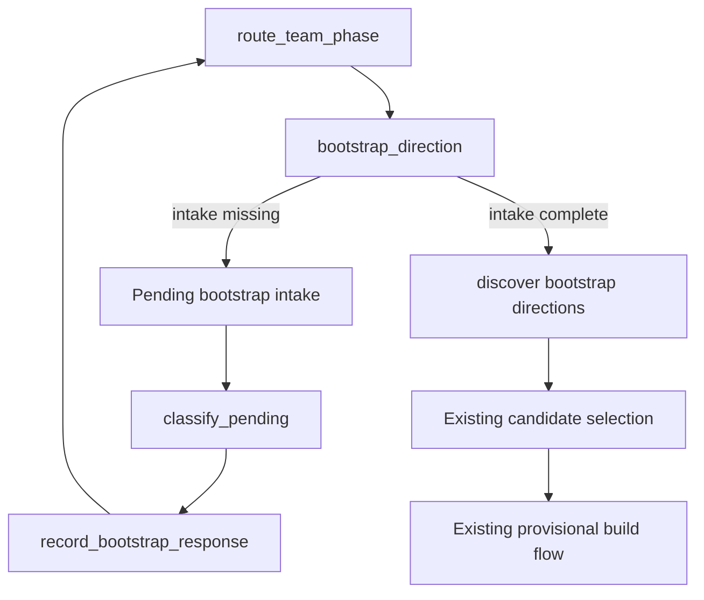

# Empty-Team Bootstrap: Verification and Design Proposal

**Date:** 2026-08-08
**Audience:** Vu / design review
**Status:** Discovery and design proposal only. No implementation plan or runtime change is
included. Every substantive conclusion is labeled **Verified finding**, **Proposal**, or
**Explicit scope decision**.

## Purpose and method

This report verifies the last routing stub from the team-phase arc: an empty team where the
user may provide a direction, an available pool, both, or neither. It re-checks current source
rather than carrying forward the original flow-discovery report's conclusions unchanged.

The source check covered:

1. empty-phase derivation and graph routing;
2. `bootstrap_direction`, the legacy proposal path, and `_pick_role`;
3. `query_by_usage` and all four ownership modes;
4. current anchor-role, Role Compendium, and shared-teammate capabilities;
5. `CandidateEvidence` and pending-presentation persistence;
6. `classify_pending` and first-invocation routing;
7. available-pool storage, normalization, legality filtering, and unresolved entries;
8. focused tests for routing, usage ranking, ownership, and candidate provenance.

Primary sources are:

- `recommender/graph.py`;
- `recommender/nodes.py`;
- `recommender/propose.py`;
- `recommender/by_usage.py`;
- `recommender/ranking.py`;
- `recommender/state.py`;
- `recommender/slot_fill.py`;
- `recommender/anchor_roles.py`;
- `recommender/role_compendium.py`;
- `recommender/team_candidates.py`;
- `tests/recommender/test_team_phase_routing.py`;
- `tests/recommender/test_query_by_usage.py`;
- `tests/recommender/test_ranking.py`;
- `tests/recommender/test_slot_fill.py`;
- `tests/recommender/test_multi_locked_candidates.py`.

The requested prior evidence was also re-read:

- `docs/slot_fill_flow_discovery_2026-08-08.md`, Scenario 2;
- `docs/team_phase_routing_implementation_2026-08-08.md`.

## Executive conclusions

1. **Verified finding:** the generic empty-team fallback remains. Empty routes through the
   behaviorally empty `bootstrap_direction` stub and then unconditionally into
   `fill_team_draft`; `_pick_role` can still place one low-confidence `bulky_attacker` role
   based on an uncovered-team signal. It still cannot recommend an anchor species.
2. **Verified finding:** ownership support changed materially since the original report.
   `query_by_usage` now accepts `owned_first`, `owned_last`, `off`, and `owned_only`.
   `pool=None` plus `owned_first` already implements the ranking primitive for “owned-biased,
   outside allowed.”
3. **Verified finding:** that primitive does not produce a strategic direction, diverse
   alternatives, evidence attribution, or graph orchestration. A small bootstrap
   orchestration layer is still genuinely needed; a new ownership algorithm is not.
4. **Verified finding:** `CandidateEvidence`, candidate-specific target-role persistence,
   reverse Compendium evidence, and provisional full-build confirmation now exist and should
   be reused. `shared_teammates` cannot seed an empty team because it requires at least one
   anchor.
5. **Verified finding:** `classify_pending` remains deliberately presentation-bound. With no
   `PendingPresentation`, it raises `NotImplementedError`. It currently understands candidate
   selection, full-build confirmation, and completion preference only.
6. **Proposal:** keep that boundary. Add one bootstrap-presentation branch and one narrow
   bootstrap response payload; do not make `classify_pending` a general unprompted first-turn
   classifier.
7. **Verified finding:** unresolved or illegal pool entries still disappear silently.
   `PokemonSet` is only a typed storage shape, `accept_available_pool` is a no-op, and
   `query_by_usage` skips missing/illegal species without returning diagnostics.
8. **Proposal:** retain every failed raw label and surface “couldn't identify X.” Do not guess
   aliases or forms. In particular, `Eternal Floette` remains unresolved until the separately
   deferred canonical resolver exists.

## Part 1 — verified current state

### 1. Empty routing and `_pick_role`

**Verified finding — `recommender/state.py:442-446` and
`recommender/nodes.py:247-257`:** a member counts toward phase only when role, species,
ability, item, moveset, spread, and nature are all locked. Zero fully confirmed members,
including a draft containing only partial slots, is `empty`.

**Verified finding — `recommender/graph.py:22-27,66-86`:** the current opening route is:

`initialize -> accept_available_pool -> route_team_phase -> bootstrap_direction
-> propose_team_draft -> END`

The edge from `bootstrap_direction` to `propose_team_draft` is unconditional.

**Verified finding — `recommender/nodes.py:202-244`:** initialization preserves a supplied
`available_pool` or defaults it to `[]`. `accept_available_pool` returns `{}`. It performs no
parsing, validation, ownership-policy selection, or user interaction.

**Verified finding — `recommender/nodes.py:733-741`:** `bootstrap_direction` only clears
coverage, SPOF, shared-teammate, final-review, and candidate-error state. Its docstring calls
the opening direction/pool UX deferred. It does not read the available pool, archetype,
ownership mode, or pending input.

**Verified finding — `recommender/nodes.py:727-730` and
`recommender/propose.py:42-103`:** `propose_team_draft` is a thin wrapper around
`fill_team_draft`. The legacy function iterates incomplete slots, may choose a role, and then
tries attribute propagation/refinement. It does not call `query_by_usage`, build a direction
presentation, or select a species for an empty slot.

**Verified finding — `recommender/propose.py:106-149`:** `_pick_role` still:

- maps `TrickRoom` to `trick_room_setter`;
- maps `Tailwind` to `tailwind_setter`;
- returns a structured ambiguity if both are active;
- otherwise, when the empty draft has an uncovered-team signal and no present role, returns
  one low-confidence `TargetRoleDecision(role_id="bulky_attacker")` with
  `coverage_gap` provenance.

`fill_team_draft` flattens a resolved decision to an unlocked role attribute. It does not
retain the complete typed decision there, and role-to-species resolution remains absent.

**Verified finding — `tests/recommender/test_team_phase_routing.py:64-81,202-218`:** focused
tests cover empty phase derivation and stale-signal clearing. They do not test a useful empty
bootstrap presentation. Existing proposal tests cover the generic role fallback, not an
anchor recommendation.

**Conclusion:** the anchor-role and multi-locked work did not accidentally close this gap.
They improved other phases. Empty bootstrap remains a stub followed by the generic role
fallback.

### 2. What existing ownership and recommendation machinery now provides

**Verified finding — `recommender/ranking.py:9-11,14-125`:** `rank_and_cut` supports:

- `owned_first`: ownership precedes the substantive ranking key;
- `owned_last`: ownership follows the substantive key and therefore breaks only substantive
  ties;
- `off`: ownership is ignored;
- `owned_only`: the caller must filter the candidate pool before ranking.

For non-tiered ranking, ownership is applied before the final slice. An owned candidate is not
first discarded by a usage-only cut and then unsuccessfully boosted afterward.

**Verified finding — `recommender/by_usage.py:27-104`:** `query_by_usage` accepts
`available_species` and `ownership_mode`. With `pool=None`, it enumerates every legal species.
Therefore:

`query_by_usage(pool=None, available_species=owned, ownership_mode="owned_first")`

retains outside candidates while placing recognized owned species before the usage key.
`owned_last` is the weaker tie preference, `off` is pure usage order, and `owned_only` is the
hard restriction.

**Verified finding — `tests/recommender/test_query_by_usage.py:59-89` and
`tests/recommender/test_ranking.py:188-308`:** focused tests verify owned-first admission,
owned-last ordering, owned-only filtering, `off`, and invalid-mode handling.

**Verified finding:** no empty-phase production caller invokes `query_by_usage`.
`bootstrap_direction` is the missing orchestration boundary.

**Verified finding — `recommender/anchor_roles.py:48-123,171-515`:** current code can resolve a
representative build and classify it into an `AnchorRoleDecision` containing:

- primary and secondary strategic role IDs;
- primary function;
- durability intent;
- mechanisms;
- coarse kit role;
- exact and alternate reverse Compendium evidence;
- conflicts and source evidence.

This can describe what direction a usage-ranked anchor actually supports. It should not be
replaced with `_pick_role`'s generic open-slot fallback.

**Verified finding — `recommender/role_compendium.py:3126-3228`:** current Compendium readers
can return role candidates and reverse strategic-role evidence. Shipped categories cover
weather setters, redirection, Trick Room setter, Swords Dance attacker, and Nasty Plot
attacker. Compendium-first support-need resolution remains useful once an anchor exists, but
an empty bootstrap has no anchor support need to resolve.

**Verified finding — `recommender/teammates.py:303-392`:** shared-teammate discovery requires
one or more anchors and computes an all-anchor intersection. It correctly returns unavailable
for empty anchor input. It is reusable after the first lock, not for generating the first
direction.

**Verified finding — `recommender/state.py:138-176`,
`recommender/team_candidates.py:160-187`, and
`recommender/slot_fill.py:1123-1146`:** `CandidateEvidence` is the common provenance envelope
through merged candidates and pending options. It records basis, confidence, producer,
details, branch, origin, and subject. Pending options preserve candidate evidence and a
candidate-specific target-role decision.

**Conclusion:** current code already has the pieces for:

1. legal full-pool usage admission;
2. owned-biased ranking without outside exclusion;
3. representative anchor-role description;
4. Compendium facts;
5. provenance-preserving candidate presentation.

It does not yet compose those pieces into one recommended strategic direction plus genuinely
different alternatives. That composition, not another ownership mode, is the new capability.

### 3. `classify_pending` and the smallest first-turn change

**Verified finding — `recommender/graph.py:30-33`:** on an invocation without `game_type`,
`_route_start` selects `initialize`, not `classify_input`. Initial free text is therefore not
classified by the normal turn path.

**Verified finding — `recommender/nodes.py:99-199`:** `classify_pending` explicitly says
generic classification remains open. With no pending presentation it raises
`NotImplementedError`. Its supported presentation contracts are:

- schema-v1 candidate selection;
- schema-v1 full-build confirmation;
- schema-v2 completion preference.

**Verified finding — `recommender/nodes.py:265-298`:** `classify_input` always calls
`classify_pending(text, state.get("pending_presentation"))`. It can copy a completion
preference or turn a selected candidate option into `PendingSlotIntent`, but it has no
bootstrap response payload.

**Verified finding — `recommender/state.py:233-260`:** `PendingPresentation.kind` has no
bootstrap kind. Its option structure is species-oriented, so it cannot currently represent
the combined direction/pool question.

**Conclusion:** the original finding remains correct: classification is pending-presentation
bound. That is not itself a defect. A prompted opening is also a pending presentation.

**Proposal:** add only:

1. one `bootstrap_intake` pending kind;
2. one bootstrap-specific parsing branch in `classify_pending`;
3. one `bootstrap_response` intent payload and handler;
4. one graph edge from that handler back to the existing `route_team_phase`.

Do not change the `pending_presentation is None` behavior. Unprompted generic first-turn
classification remains open and out of scope.

### 4. Unresolved available-pool entries

**Verified finding — `recommender/state.py:52-71`:** `PokemonSet` is a `TypedDict`, not an
input parser. The source comment explicitly defers import parsing.

**Verified finding — `recommender/team_candidates.py:103-108`:** current ownership extraction
applies `to_id` to `row["species"]` and stores the resulting IDs. It does not prove that the ID
exists or is legal.

**Verified finding — `recommender/by_usage.py:66-77`:** when an explicit pool is supplied,
entries with no species, duplicate IDs, or species failing `is_species_legal` are skipped.
The function returns only candidates; it returns no rejected-entry diagnostic.

When raw names are used only as `available_species`, unmatched normalized IDs affect no legal
candidate. Under `owned_only`, an entirely unresolved pool can therefore yield no candidates.
Under soft ownership, it silently behaves as if those entries were not owned.

**Verified finding:** `RecommenderState` has no unresolved-pool field, and focused ownership
tests do not assert user-visible behavior for an unresolved name.

**Conclusion:** unresolved entries still disappear silently. `Eternal Floette` normalizes to
an ID that does not match the legal canonical `Floette-Eternal` ID, so current code does not
retain an explanation.

## Part 2 — design proposal

### Design objectives

**Proposal:** empty bootstrap should have two human gates:

1. one combined intake asking for direction/anchor and available pool;
2. one existing candidate-selection gate presenting a concrete default and alternatives.

The intake is not itself a species commitment. The later candidate selection continues into
the existing provisional-build and full-confirmation lifecycle.

### 1. Combined opening presentation and response contract

#### Presentation

**Proposal:** extend `PendingPresentation` with one additive kind:

```text
BootstrapIntakePresentation
  schema_version: 1
  kind: "bootstrap_intake"
  existing_pool_labels: tuple[str, ...]
  ask_direction: true
  ask_available_pool: true
```

The rendered prompt should ask both questions together:

> What direction or anchor would you like to start with, and which Pokémon are available to
> you? You can provide either, both, or say “you pick.” I can still recommend outside your
> available pool unless you request owned-only.

If structured pool entries already exist, show them in the prompt and allow the response to
omit the pool. Do not make the user repeat data already present in state.

#### Response payload

**Proposal:** the bootstrap-only classifier should return a narrow payload conceptually shaped
as:

```text
BootstrapResponsePayload
  direction_text: str | None
  anchor_text: str | None
  pool_entries: tuple[str, ...] | None
  delegated: bool
```

Semantics:

- `direction_text` preserves an explicit statement such as “Trick Room” or “Rain offense.”
- `anchor_text` preserves an explicit species/form statement such as “Gholdengo.”
- `pool_entries=None` means “the response omitted the pool; preserve the existing pool.”
- `pool_entries=()` means “the user explicitly supplied no available pool.”
- a pool-only response sets `delegated=True`;
- “you pick,” equivalent delegation language, or a reply with neither direction nor anchor
  sets `delegated=True`;
- an explicit direction or anchor sets `delegated=False` unless the user also explicitly
  delegates the unresolved portion.

The classifier extracts text and structure. It does not decide legality, canonical identity,
ownership, strategic merit, or target role.

#### Validation and persisted state

**Proposal:** a dedicated `bootstrap_response` handler should:

1. preserve or replace the raw pool according to the `None` versus empty-tuple distinction;
2. accept only entries whose current normalized ID is an exact legal species/form;
3. store accepted entries in the existing `available_pool`;
4. retain failed original labels, in input order, as `unresolved_pool_entries`;
5. persist the raw direction/anchor statement without claiming it is canonical;
6. mark bootstrap intake complete;
7. return to `route_team_phase`.

The minimal new cross-turn state is conceptually:

```text
bootstrap_intake_complete: bool
bootstrap_response: BootstrapResponsePayload | None
unresolved_pool_entries: tuple[str, ...]
ownership_mode_source: "default" | "user"
```

`ownership_mode_source` is needed because initialization currently writes `off` when no mode
was supplied. Without source information, bootstrap cannot distinguish default `off` from a
user's explicit request to disable ownership bias.

Reset clears the response, unresolved diagnostics, and completion marker. It may preserve the
repository's existing reset policy for the available pool; this task does not redefine pool
ownership across a reset.

#### Routing

**Proposal:** the cross-turn flow should be:



This marker prevents `bootstrap_direction` from asking the same question after the response
handler routes back through the still-empty phase.

If `available_pool` was supplied structurally before the first invocation, the opening still
asks for direction and displays the supplied pool. If a direction was also supplied through a
future structured bootstrap-response field, the same completion marker permits immediate
direction discovery without a redundant prompt.

### 2. Delegation path

#### Ownership policy

**Proposal:** derive one effective bootstrap mode:

1. honor a user-sourced `owned_only`, `owned_first`, `owned_last`, or `off`;
2. otherwise, if at least one pool entry was recognized, use `owned_first`;
3. otherwise use `off`.

Then call:

`query_by_usage(pool=None, n=20, available_species=recognized_pool,
ownership_mode=effective_mode)`

Using `pool=None` is essential. Passing the available pool as `pool` would make ownership a
hard candidate boundary and violate “outside allowed.”

An unresolved-only pool produces a visible warning and a global `off` ranking. It does not
silently become `owned_only`, and it does not prevent outside recommendations.

#### Direction construction

**Proposal:** use the top bounded usage result only as a seed set. For each seed:

1. resolve the representative anchor build with `resolve_anchor_build`;
2. classify it with `classify_anchor_role`;
3. retain exact and alternate reverse Compendium evidence separately;
4. derive a concise direction label from the supported strategic role and mechanisms;
5. reject no candidate merely because it lacks Compendium membership;
6. retain role conflicts and unknowns instead of inventing certainty.

A bootstrap direction option is conceptually:

```text
BootstrapDirectionOption
  anchor_species: str
  direction_label: str
  strategic_role_id: str
  primary_function: "offense" | "support" | "unknown"
  mechanism_ids: tuple[str, ...]
  target_role_decision: TargetRoleResult | None
  evidence: tuple[CandidateEvidence, ...]
```

This is a presentation/domain option, not a second provenance type.

The first option is the system's recommended concrete direction. Present one or two
alternatives selected for strategic difference, not merely the next usage ranks.

Two options count as genuinely different when at least one of these differs materially:

- strategic role;
- primary offense/support function;
- enabling mechanism or field mode.

Examples include setup offense versus automatic weather support, or fast pressure versus
Trick Room. Two bulky attackers with different usage ranks are not automatically distinct
directions.

#### Explicit user direction

**Proposal:** an explicit anchor is inserted into the bounded seed set if it is an exact legal
ID, even if usage rank would otherwise cut it. An explicit direction statement filters or
orders compatible supported profiles before the system default is chosen.

If the statement cannot be mapped without a general natural-language intent redesign, retain
it as unresolved and ask a bootstrap-specific clarification. Do not route it through
`_pick_role`'s generic bulky-attacker fallback.

#### Strategic-role vocabulary boundary

**Verified finding:** `AnchorRoleDecision.role_id` is an open string, while
`TargetRoleDecision.role_id` is currently limited to seven target roles. Current Compendium
directions such as Rain setter, redirection, Swords Dance attacker, and Nasty Plot attacker
are broader than that target vocabulary.

**Explicit scope decision:** this report does not redesign the permanent role taxonomy.

**Proposal:** never coerce an unsupported strategic direction into the nearest current target
role. For a direction that maps exactly, attach the normal candidate-specific
`TargetRoleDecision`. Otherwise attach a structured unresolved target-role result and stop
before provisional refinement until that role is resolved. The future implementation plan
must either approve an additive target-role vocabulary change or define a reviewed mapping;
this design does not choose one silently.

### 3. Provenance and recommendation attribution

**Proposal:** reuse `CandidateEvidence` for every factual or policy claim. Do not add
`BootstrapEvidence`, `DirectionEvidence`, or another parallel provenance hierarchy.

Each option may carry separate evidence rows such as:

1. usage fact:
   - `basis="usage_backed"`;
   - producer `query_by_usage`;
   - evidence includes current usage rank.
2. ownership fact:
   - additive `basis="ownership_backed"`;
   - producer `bootstrap_pool_validation`;
   - evidence includes the matched original pool label.
3. Compendium fact:
   - `basis="compendium_backed"`;
   - producer `reverse_compendium_evidence`;
   - evidence identifies exact versus alternate role support.
4. system recommendation:
   - `basis="synthesized"`;
   - producer `bootstrap_direction_policy`;
   - evidence states why this option was selected, such as owned-first admission, supported
     strategic role, and difference from alternatives.

The additive ownership basis extends the existing envelope; it does not introduce a second
provenance object.

The presentation must render these as different claim types:

- “Usage rank N” is a tool-produced fact.
- “In your available pool” is an input-validation fact.
- “Excellent Rain Setter” is a Compendium fact.
- “Recommended starting direction” is the system's policy conclusion.

Ownership or popularity alone must not be worded as proof that a direction is strategically
best.

After a selectable option has a defensible candidate-specific target role, reuse the current:

`candidate selection -> PendingSlotIntent -> provisional full build
-> full-build confirmation -> atomic commit`

No bootstrap-specific refinement or commit path is needed.

### 4. Unresolved pool-entry policy

**Proposal:** unresolved entries must be surfaced, not dropped.

Required behavior:

- preserve the user's original spelling;
- show “Couldn't identify: Eternal Floette” alongside the next bootstrap presentation;
- exclude the unresolved label from ownership matching and legality claims;
- continue with recognized entries and outside candidates;
- if every entry is unresolved, explicitly state that no owned bias was applied;
- do not suggest or apply a correction;
- allow the user to replace the pool on a later bootstrap response.

**Reasoning:** silent removal changes recommendation behavior while hiding why. Surfacing the
failure is the minimum honest behavior and does not absorb canonical resolution. Guessing
`Floette-Eternal` would cross the deferred boundary and create an incomplete alias policy.

### 5. Narrow `classify_pending` change

**Proposal:** add a branch selected only when
`pending_presentation.kind == "bootstrap_intake"`.

That branch returns:

```text
turn_intent: "bootstrap_response"
turn_payload: BootstrapResponsePayload
```

The graph routes this intent to the bootstrap response handler, then back to
`route_team_phase`.

All existing behavior remains:

- no pending presentation still raises or delegates to the separately configured generic
  classifier;
- candidate selection parsing is unchanged;
- full-build confirmation parsing is unchanged;
- completion-preference parsing is unchanged.

This is a prompted-response extension, not a general first-turn intent classifier.

## Design invariants and review scenarios

These are proposal checks for design review, not implementation tests.

1. **Combined intake:** the first empty-team prompt asks for direction/anchor and available
   pool together.
2. **Pre-supplied pool:** an existing structured pool is displayed and preserved when the
   reply omits pool entries.
3. **Explicit empty pool:** an explicit “none” can clear the pool without being confused with
   omission.
4. **Pool-only delegation:** a pool listing with no direction triggers system direction
   recommendation.
5. **Full delegation:** “you pick” produces one default and genuinely different alternatives.
6. **Explicit direction:** a legal explicit anchor enters the seed set even outside the usage
   cut.
7. **No repeated intake:** after the bootstrap response handler returns through
   `route_team_phase`, the empty handler proceeds to direction discovery.
8. **Owned, outside allowed:** recognized owned species are preferred before the cut while
   unowned legal candidates remain eligible.
9. **Explicit ownership policy:** a user-sourced `off`, `owned_last`, or `owned_only` is not
   overwritten by the bootstrap default.
10. **Unresolved visibility:** every failed raw pool label is retained and shown.
11. **Unresolved-only pool:** global alternatives remain available, with an explicit statement
    that no owned bias was applied.
12. **No alias guessing:** `Eternal Floette` is reported unresolved; it is not rewritten to
    `Floette-Eternal`.
13. **Alternative diversity:** alternatives differ by strategic role, primary function, or
    enabling mechanism, not only usage order.
14. **Provenance separation:** usage, ownership, Compendium, and recommendation-policy claims
    remain separate `CandidateEvidence` entries.
15. **Target-role honesty:** an unsupported strategic direction remains unresolved instead of
    being relabeled `bulky_attacker`.
16. **Terminal reuse:** a resolved selection enters the existing provisional-build,
    confirmation, and atomic-commit lifecycle.
17. **Reset:** bootstrap intake state and unresolved diagnostics do not survive a team reset.

## Explicit out-of-scope boundaries

### Canonical name/form resolution

No alias table, fuzzy matching, form inference, base/Mega propagation, or ambiguity prompt is
designed here. Exact current IDs are accepted; failures are surfaced.

### Condition resilience

The direction may factually identify Rain, Snow, Trick Room, or another mechanism. This task
does not assess backup setters or condition-independent modes.

### Selected-four modeling

Bootstrap does not evaluate bring-four combinations or mutually exclusive Mega choices.

### General first-turn intent classification

Only a reply to `bootstrap_intake` is classified. Free text without a pending presentation
remains outside this design.

### Permanent role-taxonomy redesign

The mismatch between open strategic role IDs and the narrower `TargetRoleId` is exposed and
handled as unresolved. This report does not silently expand or remap the taxonomy.

## Residual risks

1. **Strategic-direction diversity needs calibration.** Role/function/mechanism difference is
   an auditable starting rule, but real recommendations may expose near-duplicates requiring
   a later policy adjustment.
2. **Free-form extraction is not implemented.** The narrow payload and dispatch boundary are
   specified, but deterministic versus configured-model parsing remains an implementation
   review choice.
3. **Exact-ID validation intentionally rejects familiar aliases.** This is user-visible and
   honest, but remains friction until canonical resolution is separately designed.
4. **Target-role vocabulary can pause refinement.** This prevents false role claims but means
   some strategically useful Compendium directions require a reviewed additive vocabulary
   decision before end-to-end implementation.

## Review gate

Review the verified findings and proposed contracts before creating an implementation plan.
In particular, approve or revise:

1. `bootstrap_intake` as a pending presentation rather than general first-turn
   classification;
2. the response-handler round trip through `route_team_phase`;
3. exact-ID acceptance plus visible unresolved labels;
4. `owned_first` as the default only when recognized ownership exists and no user ownership
   mode was supplied;
5. bounded usage seeds plus anchor-role/Compendium direction synthesis;
6. role/function/mechanism difference as the minimum alternative-diversity rule;
7. additive ownership evidence inside `CandidateEvidence`;
8. structured unresolved target roles instead of a taxonomy change in this task.

No implementation, runtime test, ADR entry, master-project-log entry, condition-resilience
design, selected-four design, canonical resolver, or general first-turn classifier belongs in
this pass.
